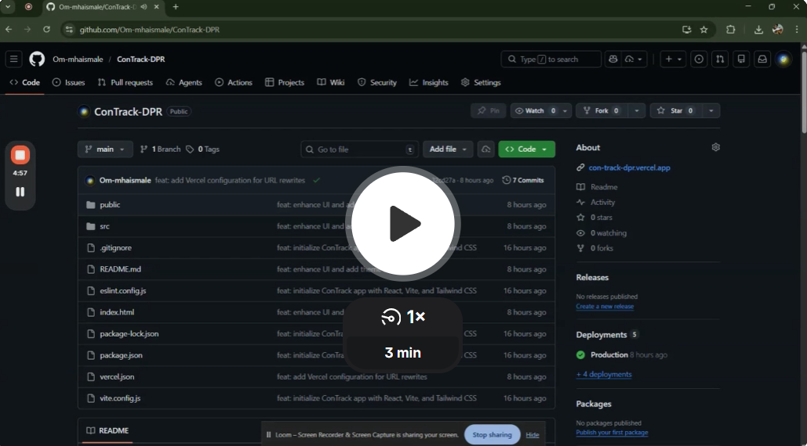

# 🚧 ConTrack DPR

**Construction Field Management Web App** — submit and track **Daily Progress Reports (DPR)** from any device.


---

# 🎬 Project Walkthrough

Want to quickly understand how **ConTrack DPR** works?

Click the thumbnail below to watch the **full implementation demo and explanation.**

<p align="center">
  
</p>

<p align="center">
  <a href="https://www.loom.com/share/1436857ad422406c960250f9d4bf3841">
    
  </a>
</p>

<p align="center">
🚀 <strong>Click the preview above to watch the full demo</strong>
</p>

---

# ✨ Features

| Feature | Details |
|---|---|
| **Login** | Mock authentication with email + password validation |
| **Project Dashboard** | Card grid with status filter (All / In Progress / Pending / Completed) |
| **DPR Form** | Project, date, weather, description, worker count, photo upload (1–3 images) |
| **Dark Mode** | Toggle via navbar — persisted in `localStorage` |
| **Validation** | Descriptive field-level error messages |
| **Responsive Design** | Mobile-first layout (375px → 1440px+) |
| **Animations** | Smooth card entrance and hover interactions |

---

# 🔐 Demo Credentials

```
Email:    test@test.com
Password: 123456
```

---

# ⚡ Quick Start

### 1️⃣ Clone the repository

```bash
git clone https://github.com/your-username/ConTrack-DPR.git
cd ConTrack-DPR
```

---

### 2️⃣ Install dependencies

```bash
npm install
```

---

### 3️⃣ Start development server

```bash
npm run dev
```

Open in browser:

```
http://localhost:5173
```

---

# 🛠 Available Scripts

| Command | Purpose |
|---|---|
| `npm run dev` | Start development server |
| `npm run build` | Create production build |
| `npm run preview` | Preview production build locally |
| `npm run lint` | Run ESLint |

---

# 📂 Project Structure

```
src/
├── assets/             
├── components/
│   ├── Navbar.jsx
│   └── ProtectedRoute.jsx
│
├── constants/
│   └── projects.js
│
├── context/
│   ├── AuthContext.jsx
│   └── ThemeContext.jsx
│
├── pages/
│   ├── Login.jsx
│   ├── ProjectList.jsx
│   └── DPRForm.jsx
│
├── utils/
│   └── validation.js
│
├── App.jsx
├── index.css
└── main.jsx
```

---

# 🧰 Tech Stack

| Technology | Purpose |
|---|---|
| **React 19** | Frontend framework |
| **Vite 7** | Fast build tool |
| **Tailwind CSS 4** | Utility-first styling |
| **React Router 7** | Client-side routing |
| **Lucide React** | Icons |

---

# ⚠ Known Limitations

- Authentication is **mock-based**
- DPR submissions are **not stored in a database**
- Image uploads create **local preview URLs only**

---

# 👨‍💻 Author

**Om Mhaismale**

BTech Student • Frontend Developer • Data Enthusiast

```
Built with ⚡ React + Tailwind
```
